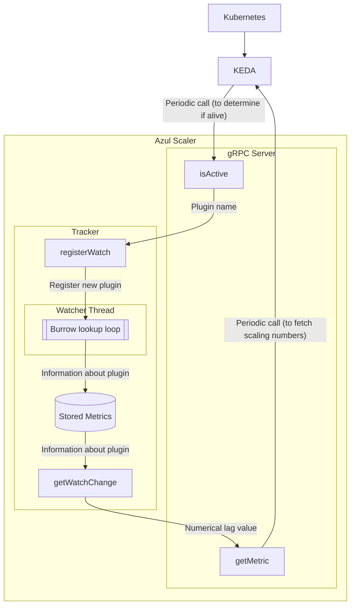

# Azul Scaler

Dynamically scales Azul components based on system throughput.

THIS IS EXPERIMENTAL AND IS A WORK IN PROGRESS.

Do not enable this unless you know what you are doing, and are willing to watch your HPAs
constantly.

This matches Kafka consumer group names, provided by dispatcher in Redis and determines a metric
similar to an ETA for a given plugin to guide system scaling decisions.

## Architecture

The scaler utilises both a 'frontend' gRPC server to service requests from KEDA (the
custom metrics server utilised by Azul to provide scaling information to Kubernetes HPAs),
as well as a Tracker which periodically polls backend data sources (currently just Kafka) for
information on how well system components are performing.

The lifecycle of a plugin being scaled through this looks like the following:



## Installation

```bash
pip install azul-scaler
```

To build the Protobuf protocol, run the following:

```bash
pip install grpcio-tools
mkdir -p azul_scaler/grpc/
python -m grpc_tools.protoc -I protos --python_out=azul_scaler/grpc --pyi_out=azul_scaler/grpc --grpc_python_out=azul_scaler/grpc protos/externalscaler.proto
```

## Usage

By default, launching the default entrypoint (defined in `pyproject.yaml`) will start up a unencrypted
gRPC listener on port :8090. This can be configured via environmental variables listed in `settings.py`.

This can be used with KEDA directly - create a service for this scaler, and use KEDA's external
scaler with the scalerAddress pointed at the service (including the namespace for cross-namespace
connectivity).

## Model

The scaler has a series of parameters that need to be configured in order to use them.

These parameters differ between the entity type used (currently only 'plugin').

| KEY             | VALUE                                                             |
| --------------- | ----------------------------------------------------------------- |
| entityName      | 'plugin'                                                          |
| pluginName      | The name of the plugin deployment.                                |
| targetSize      | The maximum consumer lag before scaling (pass as string to KEDA). |
| includeHistoric | If the historical backlog should be included ('true' or 'false'). |
